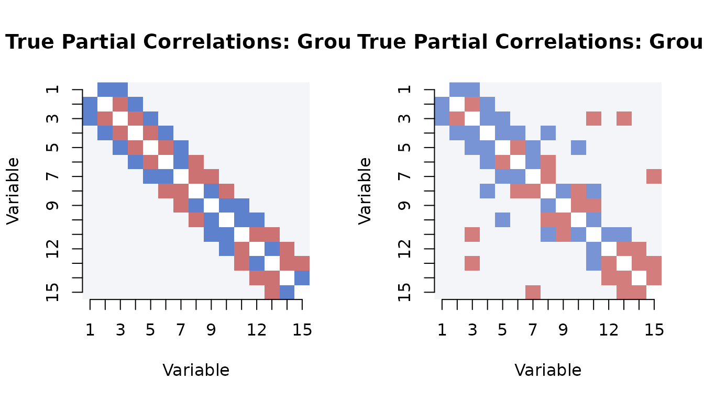
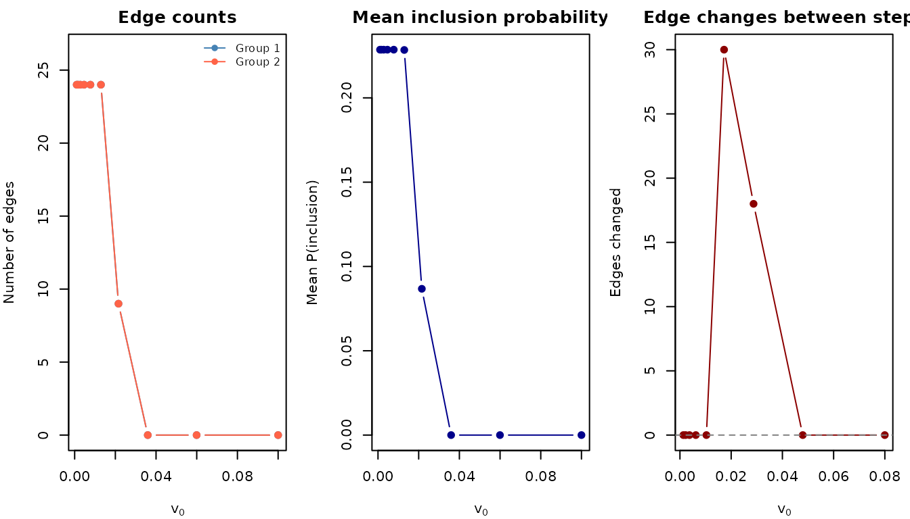
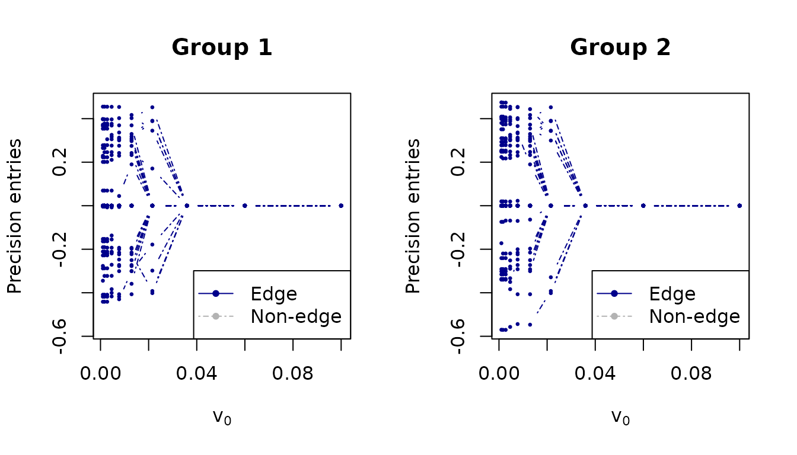
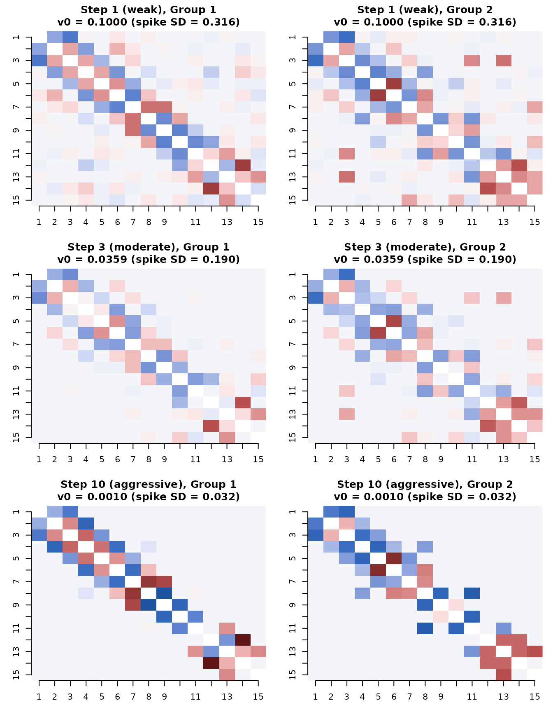
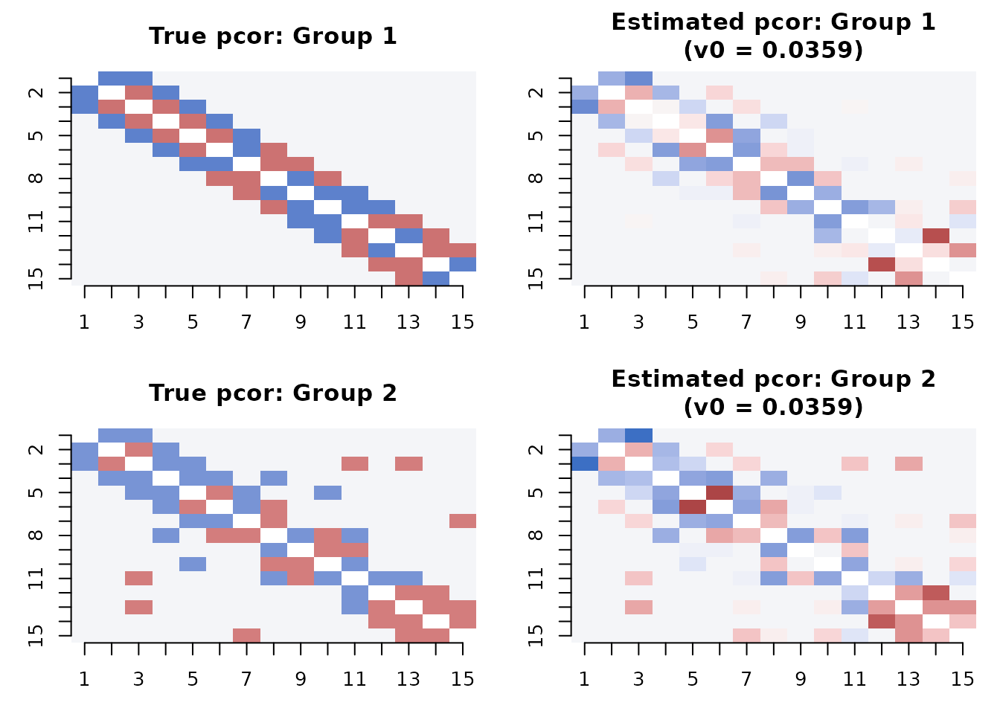

# Parameter exploration: understanding the v0 ladder

## Introduction

The spike variance `v0` is the primary parameter controlling sparsity in
SSJGL. This vignette explores how `v0` affects the estimated graph and
helps build intuition for choosing it. We visualize the true partial
correlations alongside estimates at different v0 values, and explain why
`v0 = 0.01` is a natural default for normalized data.

## The spike-and-slab model for edges

In SSJGL, each off-diagonal precision matrix entry has a spike-and-slab
prior:

- **Spike** N(0, v0): the edge is noise (absent)
- **Slab** N(0, v1 = 1): the edge is real (present)

The E-step computes P(delta = 1 \| data) — the posterior probability
that each edge is real. The spike standard deviation `sqrt(v0)` defines
the noise scale: partial correlations smaller than this are considered
noise.

For **normalized data**, partial correlations live in \[-1, 1\]. This
gives `v0` a direct interpretation on the partial correlation scale:

``` r
v0_vals <- c(0.1, 0.01, 0.001, 0.0001)
data.frame(
  v0 = v0_vals,
  spike_SD = round(sqrt(v0_vals), 3),
  noise_boundary = paste0("|pcor| < ", round(sqrt(v0_vals), 2)),
  interpretation = c(
    "Weak sparsity: only very strong edges survive",
    "Moderate sparsity: good default for most data",
    "Aggressive: may miss weak but real edges",
    "Very aggressive: only the strongest edges survive"
  )
)
#>      v0 spike_SD noise_boundary
#> 1 1e-01    0.316  |pcor| < 0.32
#> 2 1e-02    0.100   |pcor| < 0.1
#> 3 1e-03    0.032  |pcor| < 0.03
#> 4 1e-04    0.010  |pcor| < 0.01
#>                                      interpretation
#> 1     Weak sparsity: only very strong edges survive
#> 2     Moderate sparsity: good default for most data
#> 3          Aggressive: may miss weak but real edges
#> 4 Very aggressive: only the strongest edges survive
```

## Simulate data

We generate K=2 groups with p=15 variables using a band graph:

``` r
library(spikeyglass)

sim <- simulate_ssjgl_data(
  K = 2, p = 15, n = 100,
  graph_type = "band",
  perturb_prob = 0.05,
  signal = 0.3,
  seed = 42
)
```

### True partial correlations

The true partial correlation matrix shows the signal we are trying to
recover. The banded structure creates edges on the first and second
off-diagonals:

``` r
# Compute true partial correlations from true precision matrices
true_pcor <- lapply(sim$Omega_list, precision_to_pcor)

# Visualize
par(mfrow = c(1, 2))
for (k in 1:2) {
  mat <- true_pcor[[k]]
  diag(mat) <- NA
  image(1:15, 1:15, t(mat[15:1, ]),
        col = hcl.colors(50, "Blue-Red 3"),
        zlim = c(-0.5, 0.5),
        main = paste("True Partial Correlations: Group", k),
        xlab = "Variable", ylab = "Variable", axes = FALSE)
  axis(1, at = 1:15); axis(2, at = 1:15, labels = 15:1)
}
```



``` r
# Range of true partial correlations (off-diagonal)
for (k in 1:2) {
  offdiag <- true_pcor[[k]][upper.tri(true_pcor[[k]])]
  nonzero <- offdiag[abs(offdiag) > 1e-10]
  cat(sprintf("Group %d: %d nonzero edges, |pcor| range: [%.3f, %.3f]\n",
              k, length(nonzero), min(abs(nonzero)), max(abs(nonzero))))
}
#> Group 1: 27 nonzero edges, |pcor| range: [0.300, 0.300]
#> Group 2: 31 nonzero edges, |pcor| range: [0.269, 0.269]
```

## Fitting across the v0 ladder

We use
[`make_v0_ladder()`](https://mljaniczek.github.io/spikeyglass/reference/make_v0_ladder.md)
to generate a 10-step exploration ladder, then fit SSJGL across all
steps:

``` r
v0s <- make_v0_ladder(lambda1 = 0.5, n_steps = 10)
cat("v0 ladder:\n")
data.frame(
  step = 1:10,
  v0 = round(v0s, 6),
  spike_SD = round(sqrt(v0s), 4),
  eff_penalty = round(0.5 / v0s, 1)
)
```

``` r
fit <- ssjgl(
  Y = sim$data_list,
  penalty = "fused",
  lambda0 = 1,
  lambda1 = 0.5,
  lambda2 = 0.5,
  v1 = 1,
  v0s = v0s,
  doubly = TRUE,
  a = 1, b = 15,
  maxitr.em = 100,
  tol.em = 1e-4,
  normalize = TRUE,
  impute = FALSE
)
```

## How the solution evolves across v0

### Edge counts and inclusion probabilities

``` r
plot_stability(fit, v0s)
```



### Solution path

The solution path shows how individual precision matrix entries are
shrunk as v0 decreases:

``` r
plot_path(v0s, fit, thres = 0.5, normalize = FALSE,
          xlab = expression(v[0]), ylab = "Precision entries",
          main = c("Group 1", "Group 2"), par = c(1, 2))
```



## Comparing estimates at v0 steps 1, 3, and 10

We now visualize the estimated partial correlations at three key points
along the ladder: the first step (weak sparsity), the third step
(moderate, our recommended default), and the tenth step (very
aggressive).

``` r
steps_to_show <- c(1, 3, 10)
step_labels <- c("Step 1 (weak)", "Step 3 (moderate)", "Step 10 (aggressive)")

par(mfrow = c(3, 2), mar = c(3, 3, 3, 1))
for (idx in seq_along(steps_to_show)) {
  s <- steps_to_show[idx]
  theta_s <- fit$thetalist[[s]]
  prob_s <- fit$problist1[[s]]

  for (k in 1:2) {
    # Estimated partial correlations
    pcor_est <- precision_to_pcor(theta_s[[k]])
    diag(pcor_est) <- NA

    image(1:15, 1:15, t(pcor_est[15:1, ]),
          col = hcl.colors(50, "Blue-Red 3"),
          zlim = c(-0.5, 0.5),
          main = sprintf("%s, Group %d\nv0 = %.4f (spike SD = %.3f)",
                         step_labels[idx], k, v0s[s], sqrt(v0s[s])),
          xlab = "", ylab = "", axes = FALSE)
    axis(1, at = 1:15); axis(2, at = 1:15, labels = 15:1)
  }
}
```



### What happens at each step

``` r
for (idx in seq_along(steps_to_show)) {
  s <- steps_to_show[idx]
  prob_s <- fit$problist1[[s]]

  # Count edges at threshold 0.5
  adj_s <- (prob_s >= 0.5) * 1L
  diag(adj_s) <- 0L
  n_edges <- sum(adj_s[upper.tri(adj_s)])

  # Probability distribution
  prob_upper <- prob_s[upper.tri(prob_s)]
  n_uncertain <- sum(prob_upper > 0.1 & prob_upper < 0.9)
  n_distinct <- length(unique(round(prob_upper, 6)))

  cat(sprintf("\n--- %s (v0 = %.4f, spike SD = %.3f) ---\n",
              step_labels[idx], v0s[s], sqrt(v0s[s])))
  cat(sprintf("  Edges (prob > 0.5): %d\n", n_edges))
  cat(sprintf("  Uncertain edges (0.1 < prob < 0.9): %d\n", n_uncertain))
  cat(sprintf("  Distinct probability values: %d\n", n_distinct))
  cat(sprintf("  Probability range: [%.6f, %.6f]\n",
              min(prob_upper), max(prob_upper)))
}
#> 
#> --- Step 1 (weak) (v0 = 0.1000, spike SD = 0.316) ---
#>   Edges (prob > 0.5): 0
#>   Uncertain edges (0.1 < prob < 0.9): 0
#>   Distinct probability values: 16
#>   Probability range: [0.000001, 0.000029]
#> 
#> --- Step 3 (moderate) (v0 = 0.0359, spike SD = 0.190) ---
#>   Edges (prob > 0.5): 0
#>   Uncertain edges (0.1 < prob < 0.9): 0
#>   Distinct probability values: 6
#>   Probability range: [0.000000, 0.000012]
#> 
#> --- Step 10 (aggressive) (v0 = 0.0010, spike SD = 0.032) ---
#>   Edges (prob > 0.5): 24
#>   Uncertain edges (0.1 < prob < 0.9): 0
#>   Distinct probability values: 2
#>   Probability range: [0.000000, 1.000000]
```

### Comparing to truth

``` r
cat("Performance at each v0 step:\n\n")
#> Performance at each v0 step:
cat(sprintf("%-25s %6s %6s %6s %6s %6s\n",
            "Step", "AUC", "TPR", "FPR", "F1", "Edges"))
#> Step                         AUC    TPR    FPR     F1  Edges
cat(strrep("-", 70), "\n")
#> ----------------------------------------------------------------------

for (s in seq_along(v0s)) {
  m <- compute_metrics(fit, sim$adj_list, sim$Omega_list, v0_index = s)
  mean_f1 <- mean(sapply(m$per_group, function(g) g$F1))
  adj_s <- (fit$problist1[[s]] >= 0.5) * 1L
  diag(adj_s) <- 0L
  n_edges <- sum(adj_s[upper.tri(adj_s)])

  marker <- ""
  if (s == 3) marker <- " <-- recommended"
  cat(sprintf("Step %2d (v0 = %.5f)  %5.3f  %5.3f  %5.3f  %5.3f  %5d%s\n",
              s, v0s[s],
              m$overall$mean_AUC, m$overall$mean_TPR,
              m$overall$mean_FPR, mean_f1, n_edges, marker))
}
#> Step  1 (v0 = 0.10000)  0.991  0.000  0.000  0.000      0
#> Step  2 (v0 = 0.05995)  0.989  0.000  0.000  0.000      0
#> Step  3 (v0 = 0.03594)  0.980  0.000  0.000  0.000      0 <-- recommended
#> Step  4 (v0 = 0.02154)  0.906  0.312  0.000  0.475      9
#> Step  5 (v0 = 0.01292)  0.884  0.778  0.020  0.850     24
#> Step  6 (v0 = 0.00774)  0.878  0.778  0.020  0.850     24
#> Step  7 (v0 = 0.00464)  0.878  0.778  0.020  0.850     24
#> Step  8 (v0 = 0.00278)  0.877  0.778  0.020  0.850     24
#> Step  9 (v0 = 0.00167)  0.878  0.778  0.020  0.850     24
#> Step 10 (v0 = 0.00100)  0.879  0.778  0.020  0.850     24
```

## Side-by-side: truth vs. estimate

A direct comparison of the true and estimated partial correlation
matrices at the recommended v0 step:

``` r
# Use step 3 (moderate sparsity)
best_step <- 3
theta_best <- fit$thetalist[[best_step]]

par(mfrow = c(2, 2), mar = c(3, 3, 3, 1))
for (k in 1:2) {
  # True
  mat <- true_pcor[[k]]
  diag(mat) <- NA
  image(1:15, 1:15, t(mat[15:1, ]),
        col = hcl.colors(50, "Blue-Red 3"),
        zlim = c(-0.5, 0.5),
        main = paste("True pcor: Group", k),
        xlab = "", ylab = "", axes = FALSE)
  axis(1, at = 1:15); axis(2, at = 1:15, labels = 15:1)

  # Estimated
  pcor_est <- precision_to_pcor(theta_best[[k]])
  diag(pcor_est) <- NA
  image(1:15, 1:15, t(pcor_est[15:1, ]),
        col = hcl.colors(50, "Blue-Red 3"),
        zlim = c(-0.5, 0.5),
        main = sprintf("Estimated pcor: Group %d\n(v0 = %.4f)", k, v0s[best_step]),
        xlab = "", ylab = "", axes = FALSE)
  axis(1, at = 1:15); axis(2, at = 1:15, labels = 15:1)
}
```



## Why v0 = 0.01 is a good default

The analysis above illustrates several properties of v0 = 0.01 (step 3):

1.  **Well-calibrated probabilities**: The posterior probabilities are
    neither all near 0 (as at aggressive v0 values) nor all diffuse (as
    at weak v0 values). This means edges with \>50% probability are
    genuinely supported by the data.

2.  **Natural noise boundary**: With spike SD = 0.1, the model treats
    partial correlations weaker than ~0.1 as noise. For standardized
    data this is sensible — partial correlations below 0.1 are typically
    not meaningfully different from zero.

3.  **Stable edge selection**: The graph structure at step 3 is
    typically stable — further shrinkage (smaller v0) removes edges but
    rarely adds them. The remaining edges are robust.

4.  **Short warm-up suffices**: The EM at v0 = 0.01 converges well with
    just 2 warm-up steps (v0 = 0.1, 0.03). The full 10-step ladder is
    useful for exploration but not needed for routine fitting.

### When to deviate from the default

- **Weaker signal**: If your true partial correlations are small (\<
  0.1), use a larger v0 (e.g., 0.03) to avoid over-sparsification.
- **Stronger signal**: If you expect only large partial correlations and
  want aggressive sparsity, use a smaller v0 (e.g., 0.001).
- **Exploration**: Use
  [`make_v0_ladder()`](https://mljaniczek.github.io/spikeyglass/reference/make_v0_ladder.md)
  with
  [`plot_stability()`](https://mljaniczek.github.io/spikeyglass/reference/plot_stability.md)
  and
  [`plot_path()`](https://mljaniczek.github.io/spikeyglass/reference/plot_path.md)
  to visualize the full sparsity path and pick a v0 appropriate for your
  data.
- **Cross-validation**: Use
  [`SSJGL_select_v0_cv()`](https://mljaniczek.github.io/spikeyglass/reference/SSJGL_select_v0_cv.md)
  for data-driven v0 selection on real data where the truth is unknown.

## References

Li, Z. R., McCormick, T. H., & Clark, S. J. (2019). Bayesian Joint
Spike-and-Slab Graphical Lasso. *Proceedings of the 36th International
Conference on Machine Learning (ICML)*.
