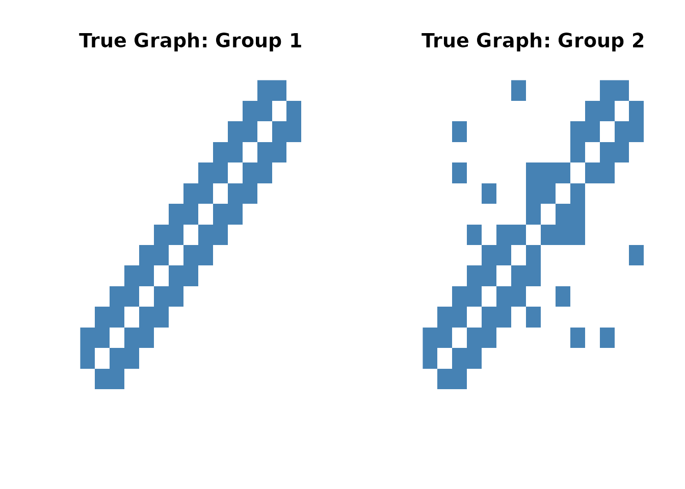
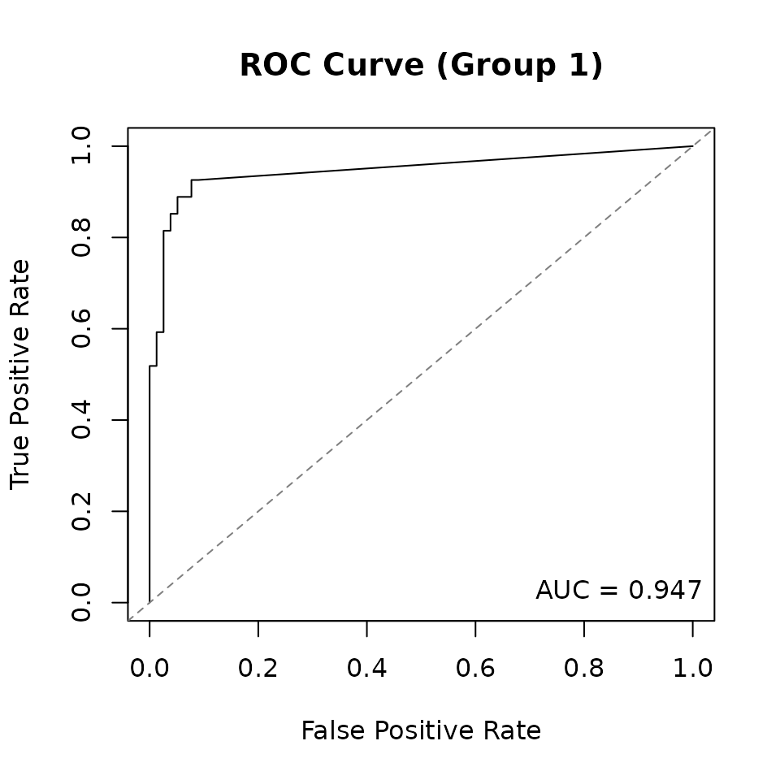

# Using spike-and-slab joint graphical lasso

## Introduction

The `spikeyglass` package implements the Bayesian Spike-and-Slab Joint
Graphical Lasso (SSJGL) from Li et al. (2019). This method estimates
multiple related precision matrices (inverse covariance matrices) across
K groups simultaneously, encouraging shared sparsity structure while
allowing group-specific differences.

Key features:

- **Adaptive penalization**: spike-and-slab priors automatically
  determine edge-specific penalty weights
- **Two penalty types**: fused (penalizes pairwise differences) and
  group (penalizes L2 norm across groups)
- **Posterior edge probabilities**: each edge gets a posterior inclusion
  probability P(delta = 1), enabling principled edge selection
- **Missing data handling**: built-in imputation via conditional MVN

## Simulate data

We generate a small synthetic example with K=2 groups and p=15 variables
using a banded (AR-2) graph with a few differential edges.

``` r
library(spikeyglass)

sim <- simulate_ssjgl_data(
  K = 2, p = 15, n = 100,
  graph_type = "band",
  perturb_prob = 0.05,
  signal = 0.3,
  seed = 42
)

# True adjacency matrices
cat("Group 1 edges:", sum(sim$adj_list[[1]][upper.tri(sim$adj_list[[1]])]), "\n")
#> Group 1 edges: 27
cat("Group 2 edges:", sum(sim$adj_list[[2]][upper.tri(sim$adj_list[[2]])]), "\n")
#> Group 2 edges: 31

# Visualize true graph structures
par(mfrow = c(1, 2))
image(sim$adj_list[[1]], main = "True Graph: Group 1",
      col = c("white", "steelblue"), axes = FALSE)
image(sim$adj_list[[2]], main = "True Graph: Group 2",
      col = c("white", "steelblue"), axes = FALSE)
```



## Choosing hyperparameters

SSJGL has three penalty parameters (`lambda0`, `lambda1`, `lambda2`) and
a spike variance parameter `v0`. Understanding how to set these is key
to getting good results.

### Lambda parameters

The spike-and-slab E-step produces adaptive, edge-specific penalty
weights that multiply the base `lambda1` and `lambda2` values. This
means the method is **relatively insensitive to the absolute values** of
lambda1 and lambda2 (Li et al., 2019) — the adaptive weights compensate.
What matters most is:

1.  **Scale of lambda1**: Should match the scale of your data.
    - **Normalized data** (`normalize = TRUE`): use `lambda1 = 0.01` to
      `0.1`
    - **Raw data**: use `lambda1 = 0.5` to `1`
2.  **Ratio lambda2/lambda1**: Controls the balance between within-group
    sparsity and cross-group similarity.
    - `lambda2 = 0`: No borrowing across groups (separate estimation)
    - `lambda2 = lambda1`: Equal weight on sparsity and similarity
    - `lambda2 > lambda1`: Encourage more similar graphs across groups
3.  **lambda0**: Diagonal penalty. Use `lambda0 = 1` (the method is
    insensitive to this choice).

### Understanding v0: the spike variance

The spike variance `v0` is the key model parameter. In the
spike-and-slab prior, each off-diagonal precision matrix entry is drawn
from either:

- **Spike**: N(0, v0) — this edge is noise
- **Slab**: N(0, v1 = 1) — this edge is real

The spike standard deviation `sqrt(v0)` sets the scale below which
partial correlations are treated as noise. For normalized data, partial
correlations live in \[-1, 1\], so:

- `v0 = 0.1` (spike SD = 0.32): weak sparsity, broad spike
- **`v0 = 0.01` (spike SD = 0.10): moderate sparsity — good default**
- `v0 = 0.001` (spike SD = 0.03): aggressive sparsity
- `v0 = 0.0001` (spike SD = 0.01): very aggressive, may over-sparsify

With `v0 = 0.01`, the model treats edges with magnitude below ~0.1 as
noise and edges above ~0.2 as signal, with the posterior probability
smoothly interpolating in between. This produces well-calibrated
posterior probabilities for edge discovery.

### The v0 ladder (warm-starting)

The default `v0s = c(0.1, 0.03, 0.01)` provides a short warm-start
sequence: the EM starts at `v0 = 0.1` (smooth landscape, easier
optimization) and anneals to the target `v0 = 0.01`. This helps the EM
avoid local optima without running unnecessary extra steps.

For parameter exploration and diagnostics,
[`make_v0_ladder()`](https://mljaniczek.github.io/spikeyglass/reference/make_v0_ladder.md)
generates longer ladders — see
[`vignette("parameter-exploration")`](https://mljaniczek.github.io/spikeyglass/articles/parameter-exploration.md)
for details.

## Fit the model

We use `normalize = TRUE` (data is not pre-standardized),
`lambda1 = 0.5`, `lambda2 = 0.5`, and a short v0 ladder:

``` r
fit <- ssjgl(
  Y = sim$data_list,
  penalty = "fused",
  lambda0 = 1,
  lambda1 = 0.5,
  lambda2 = 0.5,
  v1 = 1,
  v0s = c(0.1, 0.03, 0.01),
  doubly = TRUE,
  a = 1, b = 15,
  maxitr.em = 100,
  tol.em = 1e-4,
  normalize = TRUE,
  impute = FALSE
)
```

``` r
print(fit)
#> Spike-and-Slab Joint Graphical Lasso (SSJGL)
#>   Groups (K): 2
#>   Variables (p): 15
#>   v0 ladder steps: 3
#>   Total EM iterations: 40
#>   Total time: 0.9 seconds
#>   Group 1: 30 non-zero edges (from precision)
#>   Group 2: 32 non-zero edges (from precision)
#>   Edges with P(inclusion) > 0.5: 32
```

## Extract results

``` r
# Precision matrices at the final v0 step
theta_hat <- coef(fit)

# Partial correlations
pcor_hat <- fitted(fit)

# Edge inclusion probabilities
probs <- extract_probabilities(fit)

# Binary adjacency from thresholding inclusion probabilities at 0.5
adj_hat <- extract_adjacency(fit, threshold = 0.5)

cat("Estimated edges (Group 1):",
    sum(adj_hat[[1]][upper.tri(adj_hat[[1]])]), "\n")
#> Estimated edges (Group 1): 32
cat("Estimated edges (Group 2):",
    sum(adj_hat[[2]][upper.tri(adj_hat[[2]])]), "\n")
#> Estimated edges (Group 2): 32
```

## Evaluate performance

Compare the estimated graphs to the truth using TPR, FPR, and AUC:

``` r
metrics <- compute_metrics(
  fit = fit,
  true_adj = sim$adj_list,
  true_omega = sim$Omega_list,
  threshold = 0.5
)

cat("=== Overall Performance ===\n")
#> === Overall Performance ===
cat(sprintf("Mean TPR: %.3f\n", metrics$overall$mean_TPR))
#> Mean TPR: 0.931
cat(sprintf("Mean FPR: %.3f\n", metrics$overall$mean_FPR))
#> Mean FPR: 0.065
cat(sprintf("Mean AUC: %.3f\n", metrics$overall$mean_AUC))
#> Mean AUC: 0.953

for (k in 1:2) {
  cat(sprintf("\n--- Group %d ---\n", k))
  g <- metrics$per_group[[k]]
  cat(sprintf("  TP=%d, FP=%d, TN=%d, FN=%d\n", g$TP, g$FP, g$TN, g$FN))
  cat(sprintf("  TPR=%.3f, FPR=%.3f, F1=%.3f\n", g$TPR, g$FPR, g$F1))
  cat(sprintf("  Frobenius norm: %.3f\n", g$frobenius_norm))
}
#> 
#> --- Group 1 ---
#>   TP=25, FP=7, TN=71, FN=2
#>   TPR=0.926, FPR=0.090, F1=0.847
#>   Frobenius norm: 1.080
#> 
#> --- Group 2 ---
#>   TP=29, FP=3, TN=71, FN=2
#>   TPR=0.935, FPR=0.041, F1=0.921
#>   Frobenius norm: 1.162
```

### ROC curve

``` r
plot_roc(metrics$roc[[1]], main = "ROC Curve (Group 1)")
```



## Select v0 via cross-validation

For real data where the truth is unknown, use cross-validation to select
the best v0. This evaluates each v0 independently using held-out
Gaussian negative log-likelihood:

``` r
v0s_cv <- make_v0_ladder(lambda1 = 0.5, n_steps = 8)

cv_res <- SSJGL_select_v0_cv(
  Y = sim$data_list,
  v0s = v0s_cv,
  folds = 3,
  penalty = "fused",
  lambda0 = 1, lambda1 = 0.5, lambda2 = 0.5,
  maxitr.em = 50, maxitr.jgl = 50,
  normalize = TRUE
)
cat("Best v0:", cv_res$v0_best, "\n")
```

## Bootstrap confidence intervals

The `SSJGL_final_with_pcor_CI` function computes bootstrap confidence
intervals for partial correlations at a given v0:

``` r
boot_res <- SSJGL_final_with_pcor_CI(
  Y = sim$data_list,
  v0_best = 0.01,
  B = 50,
  ci_level = 0.95,
  penalty = "fused",
  lambda0 = 1, lambda1 = 0.5, lambda2 = 0.5,
  normalize = TRUE
)

# Partial correlation point estimate for group 1
pcor_g1 <- boot_res$pcor_hat[[1]]

# 95% CI bounds
lo <- boot_res$CI_lower[[1]]
hi <- boot_res$CI_upper[[1]]

# Edges where CI excludes zero
significant_edges <- (lo > 0 | hi < 0)
diag(significant_edges) <- FALSE
cat("Significant edges (Group 1):",
    sum(significant_edges[upper.tri(significant_edges)]), "\n")
```

## Tuning summary

| Parameter   | Role                   | Guidance                                        |
|-------------|------------------------|-------------------------------------------------|
| `lambda0`   | Diagonal penalty       | Use 1 (insensitive)                             |
| `lambda1`   | Edge sparsity          | 0.01–0.1 (normalized), 0.5–1 (raw)              |
| `lambda2`   | Cross-group similarity | Same scale as lambda1; ratio controls borrowing |
| `v0s`       | Spike variance ladder  | `c(0.1, 0.03, 0.01)` for routine use            |
| `v1`        | Slab variance          | Leave at 1                                      |
| `a, b`      | Beta prior for pi      | `a = 1, b = p` for sparse prior                 |
| `doubly`    | Doubly spike-and-slab  | TRUE recommended for multi-group                |
| `normalize` | Mean-center variables  | TRUE unless data is pre-standardized            |

**Recommended workflow:**

1.  Set `lambda0 = 1`, choose `lambda1` based on data scale
2.  Set `lambda2 = lambda1` as starting point (adjust ratio for
    more/less cross-group similarity)
3.  Use the default `v0s = c(0.1, 0.03, 0.01)` (short warm-start to
    target v0 = 0.01)
4.  Select edges by thresholding posterior probabilities at 0.5
5.  For real data: use
    [`SSJGL_select_v0_cv()`](https://mljaniczek.github.io/spikeyglass/reference/SSJGL_select_v0_cv.md)
    to validate the v0 choice, or bootstrap CIs for edge-level inference

## References

Li, Z. R., McCormick, T. H., & Clark, S. J. (2019). Bayesian Joint
Spike-and-Slab Graphical Lasso. *Proceedings of the 36th International
Conference on Machine Learning (ICML)*.
